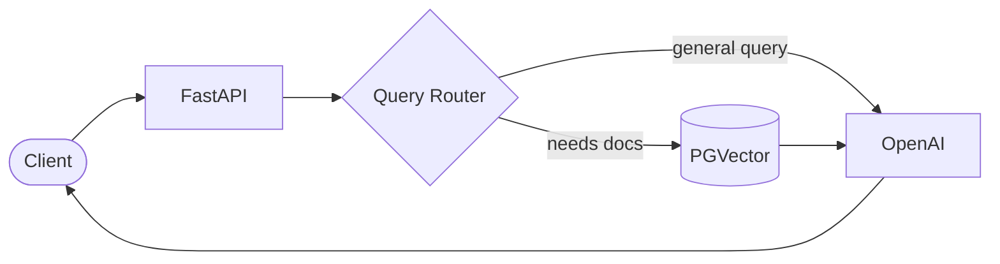

# RAG POC - Retrieval-Augmented Generation API

A FastAPI-based RAG system using LangChain, OpenAI, and PGVector for intelligent document retrieval and response generation.

## Architecture Overview



For detailed architecture diagrams, see [docs/ARCHITECTURE.md](docs/ARCHITECTURE.md).

## Features

- **PDF Document Ingestion**: Load and process PDF documents with semantic chunking
- **Vector Storage**: Store document embeddings in PostgreSQL with pgvector
- **Intelligent Query Routing**: LLM-based classification to determine if retrieval is needed
- **RAG API**: FastAPI endpoints for querying the knowledge base
- **API Key Authentication**: Simple and secure API key authentication

## Prerequisites

- Python 3.11+
- PostgreSQL with pgvector extension
- OpenAI API key

## Installation

1. Clone the repository and navigate to the project directory

2. Create a virtual environment:
```bash
python -m venv venv
source venv/bin/activate  # On Windows: venv\Scripts\activate
```

3. Install dependencies:
```bash
pip install -r requirements.txt
```

4. Set up environment variables:
```bash
cp .env.example .env
# Edit .env with your configuration
```

## Database Setup

1. Create a PostgreSQL database:
```sql
CREATE DATABASE rag_db;
```

2. Enable the pgvector extension:
```sql
\c rag_db
CREATE EXTENSION IF NOT EXISTS vector;
```

## Document Ingestion

Place your PDF documents in the `documents/` folder, then run:

```bash
python scripts/ingest_documents.py
```

## Running the API

Start the development server:

```bash
uvicorn app.main:app --reload --host 0.0.0.0 --port 8000
```

The API will be available at `http://localhost:8000`

## API Endpoints

| Endpoint | Method | Description |
|----------|--------|-------------|
| `/` | GET | API information |
| `/health` | GET | Health check |
| `/api/v1/chat` | POST | Main RAG query endpoint |
| `/docs` | GET | OpenAPI documentation |

## Usage Example

```bash
curl -X POST "http://localhost:8000/api/v1/chat" \
  -H "Content-Type: application/json" \
  -H "X-API-Key: your-api-key" \
  -d '{"query": "What is mentioned in the documents about X?"}'
```

## Project Structure

```
RAG_POC/
├── app/
│   ├── main.py              # FastAPI app entry point
│   ├── config.py            # Configuration settings
│   ├── dependencies.py      # Dependency injection
│   ├── routers/
│   │   └── chat.py          # Chat endpoint router
│   ├── services/
│   │   ├── query_router.py  # Query intent classification
│   │   ├── retriever.py     # Vector similarity search
│   │   └── generator.py     # Response generation
│   ├── models/
│   │   └── schemas.py       # Pydantic models
│   └── middleware/
│       └── auth.py          # API key authentication
├── scripts/
│   ├── ingest_documents.py  # Document ingestion script
│   ├── setup_database.py    # Database setup script
│   └── test_api.py          # API testing script
├── docs/
│   └── ARCHITECTURE.md      # Architecture diagrams
├── documents/               # PDF source folder
├── requirements.txt
└── .env.example
```

## Configuration

| Variable | Description | Default |
|----------|-------------|---------|
| `OPENAI_API_KEY` | OpenAI API key | Required |
| `DATABASE_URL` | PostgreSQL connection string | Required |
| `API_KEYS` | Comma-separated API keys | Required |
| `EMBEDDING_MODEL` | OpenAI embedding model | text-embedding-3-small |
| `LLM_MODEL` | OpenAI LLM model | gpt-4o-mini |
| `ROUTER_MODEL` | Model for query routing | gpt-3.5-turbo |
| `DOCUMENTS_PATH` | Path to PDF documents | ./documents |
| `RETRIEVAL_TOP_K` | Number of chunks to retrieve | 5 |
| `SIMILARITY_THRESHOLD` | Minimum similarity score | 0.7 |

## License

MIT
